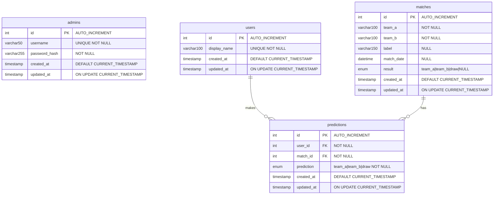

# Database Requirements Document

**Project:** World Cup Prediction Game  
**Version:** 1.0.0  
**Date:** 2026-06-11  
**Status:** Draft  

---

## Table of Contents

1. [Overview](#overview)
2. [Connection Configuration](#connection-configuration)
3. [Entity Relationship Diagram](#entity-relationship-diagram)
4. [Table Definitions](#table-definitions)
5. [Relationships](#relationships)
6. [Indexes](#indexes)
7. [Constraints & Business Rules](#constraints--business-rules)
8. [Migration Strategy](#migration-strategy)
9. [Seed Data](#seed-data)
10. [Backup & Maintenance](#backup--maintenance)

---

## Overview

The database stores all persistent data for the prediction game: admin credentials, match fixtures, participant records, and predictions. Scoring is derived from the `predictions` and `matches` tables — no separate points column is stored, keeping the source of truth in one place.

**Engine:** MySQL 8.0+  
**Character Set:** `utf8mb4`  
**Collation:** `utf8mb4_unicode_ci`  
**Tables:** 4  
**Relationships:** 2 foreign keys (both on `predictions`)

---

## Connection Configuration

### Environment Variables

All connection values must be set in `.env` (never committed). Use `.env.example` as the template.

```env
DB_HOST=127.0.0.1
DB_PORT=3306
DB_NAME=prediction_game
DB_USER=pg_app
DB_PASSWORD=<strong-password>
DB_POOL_MIN=2
DB_POOL_MAX=10
DB_CONNECT_TIMEOUT=10000
```

### Connection Pool Settings

| Parameter | Value | Notes |
|-----------|-------|-------|
| `host` | `DB_HOST` | Use `127.0.0.1`, not `localhost`, to force TCP |
| `port` | `DB_PORT` (default `3306`) | |
| `database` | `DB_NAME` | |
| `user` | `DB_USER` | Least-privilege app user (see below) |
| `password` | `DB_PASSWORD` | |
| `connectionLimit` | `DB_POOL_MAX` (default `10`) | |
| `waitForConnections` | `true` | Queue requests when pool is full |
| `connectTimeout` | `10000` ms | Fail fast on misconfiguration |
| `charset` | `utf8mb4` | Required for emoji/unicode support |

### Least-Privilege App User

The application connects as a restricted user. Run once on the database server to provision:

```sql
CREATE USER 'pg_app'@'%' IDENTIFIED BY '<strong-password>';

GRANT SELECT, INSERT, UPDATE, DELETE
  ON prediction_game.*
  TO 'pg_app'@'%';

-- Migrations run as a separate, more privileged user (not the app user)
CREATE USER 'pg_migrate'@'localhost' IDENTIFIED BY '<migration-password>';
GRANT ALL PRIVILEGES ON prediction_game.* TO 'pg_migrate'@'localhost';

FLUSH PRIVILEGES;
```

### Create the Database

```sql
CREATE DATABASE IF NOT EXISTS prediction_game
  CHARACTER SET utf8mb4
  COLLATE utf8mb4_unicode_ci;
```

---

## Entity Relationship Diagram



### Relationship Summary

```
admins       (standalone — no FK relations)
  |
  └── manages ──▶  matches   (1 admin manages many matches)
                      |
                      └── has ──▶  predictions  (1 match has many predictions)
                                        |
  users  ──── makes ─────────────────►─┘
  (1 user makes many predictions; 1 per match enforced by UNIQUE key)
```

---

## Table Definitions

### 1. `admins`

Stores the single admin account. The application supports one admin; the table is designed to allow expansion but the UI enforces a single record.

```sql
CREATE TABLE admins (
    id            INT            NOT NULL AUTO_INCREMENT,
    username      VARCHAR(50)    NOT NULL,
    password_hash VARCHAR(255)   NOT NULL,
    created_at    TIMESTAMP      NOT NULL DEFAULT CURRENT_TIMESTAMP,
    updated_at    TIMESTAMP      NOT NULL DEFAULT CURRENT_TIMESTAMP
                                          ON UPDATE CURRENT_TIMESTAMP,

    PRIMARY KEY (id),
    UNIQUE KEY uq_admins_username (username)
) ENGINE=InnoDB
  DEFAULT CHARSET=utf8mb4
  COLLATE=utf8mb4_unicode_ci;
```

| Column | Type | Nullable | Default | Notes |
|--------|------|----------|---------|-------|
| `id` | INT | NO | AUTO_INCREMENT | Surrogate primary key |
| `username` | VARCHAR(50) | NO | — | Unique login name |
| `password_hash` | VARCHAR(255) | NO | — | bcrypt hash (cost ≥ 12) |
| `created_at` | TIMESTAMP | NO | CURRENT_TIMESTAMP | Record creation time |
| `updated_at` | TIMESTAMP | NO | CURRENT_TIMESTAMP | Auto-updated on write |

---

### 2. `matches`

Stores the 10 World Cup match fixtures and their official results. The `result` column is `NULL` until the admin records the outcome.

```sql
CREATE TABLE matches (
    id          INT           NOT NULL AUTO_INCREMENT,
    team_a      VARCHAR(100)  NOT NULL,
    team_b      VARCHAR(100)  NOT NULL,
    label       VARCHAR(150)      NULL,
    match_date  DATETIME          NULL,
    result      ENUM(
                  'team_a',
                  'team_b',
                  'draw'
                )                 NULL DEFAULT NULL,
    created_at  TIMESTAMP     NOT NULL DEFAULT CURRENT_TIMESTAMP,
    updated_at  TIMESTAMP     NOT NULL DEFAULT CURRENT_TIMESTAMP
                                       ON UPDATE CURRENT_TIMESTAMP,

    PRIMARY KEY (id)
) ENGINE=InnoDB
  DEFAULT CHARSET=utf8mb4
  COLLATE=utf8mb4_unicode_ci;
```

| Column | Type | Nullable | Default | Notes |
|--------|------|----------|---------|-------|
| `id` | INT | NO | AUTO_INCREMENT | Surrogate primary key |
| `team_a` | VARCHAR(100) | NO | — | First team name |
| `team_b` | VARCHAR(100) | NO | — | Second team name |
| `label` | VARCHAR(150) | YES | NULL | Display label, e.g. "Group A – Match 1" |
| `match_date` | DATETIME | YES | NULL | Scheduled kick-off (UTC) |
| `result` | ENUM | YES | NULL | NULL = not yet played |
| `created_at` | TIMESTAMP | NO | CURRENT_TIMESTAMP | |
| `updated_at` | TIMESTAMP | NO | CURRENT_TIMESTAMP | Auto-updated on write |

**ENUM values:**

| Value | Meaning |
|-------|---------|
| `team_a` | Team A wins |
| `team_b` | Team B wins |
| `draw` | Match drawn |
| `NULL` | Result not yet recorded |

---

### 3. `users`

Stores participants shown on the leaderboard. Users are created by the admin — there is no self-registration.

```sql
CREATE TABLE users (
    id           INT          NOT NULL AUTO_INCREMENT,
    display_name VARCHAR(100) NOT NULL,
    created_at   TIMESTAMP    NOT NULL DEFAULT CURRENT_TIMESTAMP,
    updated_at   TIMESTAMP    NOT NULL DEFAULT CURRENT_TIMESTAMP
                                       ON UPDATE CURRENT_TIMESTAMP,

    PRIMARY KEY (id),
    UNIQUE KEY uq_users_display_name (display_name)
) ENGINE=InnoDB
  DEFAULT CHARSET=utf8mb4
  COLLATE=utf8mb4_unicode_ci;
```

| Column | Type | Nullable | Default | Notes |
|--------|------|----------|---------|-------|
| `id` | INT | NO | AUTO_INCREMENT | Surrogate primary key |
| `display_name` | VARCHAR(100) | NO | — | Public name shown on leaderboard; must be unique |
| `created_at` | TIMESTAMP | NO | CURRENT_TIMESTAMP | |
| `updated_at` | TIMESTAMP | NO | CURRENT_TIMESTAMP | Auto-updated on write |

---

### 4. `predictions`

Stores each user's prediction for each match. A user can have at most one prediction per match (enforced by the composite unique key). Correct/incorrect status is derived at query time by comparing `prediction` to `matches.result`.

```sql
CREATE TABLE predictions (
    id         INT       NOT NULL AUTO_INCREMENT,
    user_id    INT       NOT NULL,
    match_id   INT       NOT NULL,
    prediction ENUM(
                 'team_a',
                 'team_b',
                 'draw'
               )         NOT NULL,
    created_at TIMESTAMP NOT NULL DEFAULT CURRENT_TIMESTAMP,
    updated_at TIMESTAMP NOT NULL DEFAULT CURRENT_TIMESTAMP
                                   ON UPDATE CURRENT_TIMESTAMP,

    PRIMARY KEY (id),
    UNIQUE KEY uq_predictions_user_match (user_id, match_id),
    CONSTRAINT fk_predictions_user
        FOREIGN KEY (user_id)  REFERENCES users(id)   ON DELETE CASCADE ON UPDATE CASCADE,
    CONSTRAINT fk_predictions_match
        FOREIGN KEY (match_id) REFERENCES matches(id) ON DELETE CASCADE ON UPDATE CASCADE
) ENGINE=InnoDB
  DEFAULT CHARSET=utf8mb4
  COLLATE=utf8mb4_unicode_ci;
```

| Column | Type | Nullable | Default | Notes |
|--------|------|----------|---------|-------|
| `id` | INT | NO | AUTO_INCREMENT | Surrogate primary key |
| `user_id` | INT | NO | — | FK → `users.id` |
| `match_id` | INT | NO | — | FK → `matches.id` |
| `prediction` | ENUM | NO | — | The user's chosen outcome |
| `created_at` | TIMESTAMP | NO | CURRENT_TIMESTAMP | |
| `updated_at` | TIMESTAMP | NO | CURRENT_TIMESTAMP | Auto-updated on write |

---

## Relationships

| Relationship | Type | Parent | Child | FK Column | On Delete | On Update |
|--------------|------|--------|-------|-----------|-----------|-----------|
| User → Predictions | One-to-Many | `users.id` | `predictions.user_id` | `user_id` | CASCADE | CASCADE |
| Match → Predictions | One-to-Many | `matches.id` | `predictions.match_id` | `match_id` | CASCADE | CASCADE |

**Cascade behaviour:**
- Deleting a `user` automatically deletes all their `predictions`.
- Deleting a `match` automatically deletes all `predictions` for that match.

---

## Indexes

| Table | Index Name | Columns | Type | Purpose |
|-------|------------|---------|------|---------|
| `admins` | `PRIMARY` | `id` | PRIMARY | Row lookup |
| `admins` | `uq_admins_username` | `username` | UNIQUE | Fast login lookup, enforce uniqueness |
| `matches` | `PRIMARY` | `id` | PRIMARY | Row lookup |
| `matches` | `idx_matches_result` | `result` | INDEX | Filter unresolved matches efficiently |
| `users` | `PRIMARY` | `id` | PRIMARY | Row lookup |
| `users` | `uq_users_display_name` | `display_name` | UNIQUE | Enforce uniqueness, leaderboard sort |
| `predictions` | `PRIMARY` | `id` | PRIMARY | Row lookup |
| `predictions` | `uq_predictions_user_match` | `user_id, match_id` | UNIQUE | One prediction per user per match |
| `predictions` | `idx_predictions_match_id` | `match_id` | INDEX | Fast join when loading predictions by match |

### Leaderboard Query (key query — must be fast)

```sql
SELECT
    u.id,
    u.display_name,
    COUNT(CASE WHEN p.prediction = m.result THEN 1 END) AS total_points,
    RANK() OVER (ORDER BY COUNT(CASE WHEN p.prediction = m.result THEN 1 END) DESC) AS `rank`
FROM users u
LEFT JOIN predictions p ON p.user_id = u.id
LEFT JOIN matches     m ON m.id = p.match_id
GROUP BY u.id, u.display_name
ORDER BY total_points DESC;
```

This query uses the composite unique index on `predictions(user_id, match_id)` and the primary key on `matches(id)` — no additional indexes needed for up to 100 users and 10 matches.

---

## Constraints & Business Rules

| Rule | Enforced By |
|------|-------------|
| Max 10 matches | Application layer (check count before INSERT) |
| One prediction per user per match | `UNIQUE KEY uq_predictions_user_match` |
| `display_name` must be unique | `UNIQUE KEY uq_users_display_name` |
| `username` must be unique | `UNIQUE KEY uq_admins_username` |
| Passwords stored as bcrypt hash only | Application layer |
| `result` is NULL until admin sets it | Default NULL, set by admin action |
| Deleting a user removes their predictions | `ON DELETE CASCADE` on `fk_predictions_user` |
| Deleting a match removes its predictions | `ON DELETE CASCADE` on `fk_predictions_match` |

---

## Migration Strategy

All schema changes are versioned SQL files in `db/migrations/`. Migrations are applied in filename order and must never be edited after being pushed to the shared repository.

### File Naming

```
YYYYMMDDHHMMSS_<description>.sql
```

Example:
```
db/migrations/
├── 20260611000001_create_admins_table.sql
├── 20260611000002_create_matches_table.sql
├── 20260611000003_create_users_table.sql
├── 20260611000004_create_predictions_table.sql
└── 20260611000005_add_idx_matches_result.sql
```

### Migration File Template

```sql
-- Migration: 20260611000001_create_admins_table.sql
-- Description: Create admins table for admin authentication
-- Author: <author>
-- Date: 2026-06-11

-- ======== UP ========

CREATE TABLE admins (
    ...
);

-- ======== DOWN ========

DROP TABLE IF EXISTS admins;
```

### Rules

- Never edit a migration after it has been committed and pushed.
- To undo a schema change, write a new DOWN migration.
- Migrations must be idempotent where possible (`CREATE TABLE IF NOT EXISTS`, `DROP TABLE IF EXISTS`).
- Always include a `DOWN` block for every migration.
- Run migrations as `pg_migrate` user, not the app user.

---

## Seed Data

A seed file provisions the initial admin account. Run once on first deploy.

File: `db/seeds/001_admin_seed.sql`

```sql
-- Replace the hash below with: bcrypt.hashSync('<your-password>', 12)
INSERT INTO admins (username, password_hash)
VALUES ('admin', '$2b$12$REPLACE_WITH_REAL_BCRYPT_HASH')
ON DUPLICATE KEY UPDATE updated_at = CURRENT_TIMESTAMP;
```

> Never store a plaintext password in any file. Generate the bcrypt hash locally and paste only the hash into the seed file.

---

## Backup & Maintenance

### Backup Command

```bash
mysqldump \
  --host=127.0.0.1 \
  --user=pg_migrate \
  --password \
  --single-transaction \
  --routines \
  --triggers \
  prediction_game > backup_$(date +%Y%m%d_%H%M%S).sql
```

### Recommended Practices

| Practice | Detail |
|----------|--------|
| Automated backups | Daily full dump, retained for 30 days |
| Point-in-time recovery | Enable MySQL binary logging (`binlog`) in production |
| Connection encryption | Use TLS (`--ssl-mode=REQUIRED`) in production |
| Password rotation | Rotate `pg_app` and `pg_migrate` passwords every 90 days |
| Slow query log | Enable with `long_query_time=1` to catch unindexed queries |
